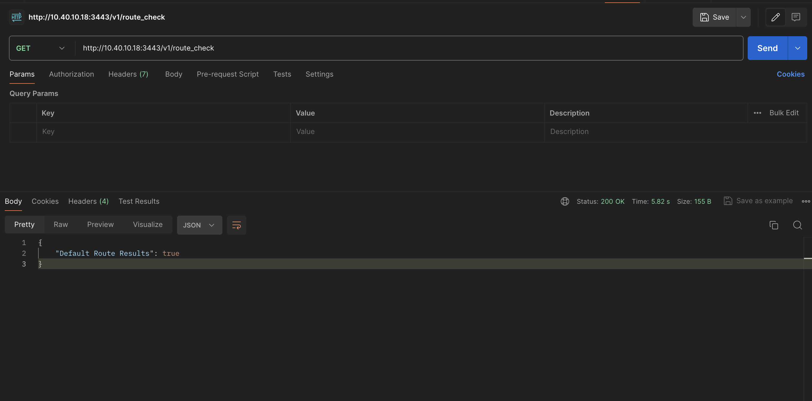
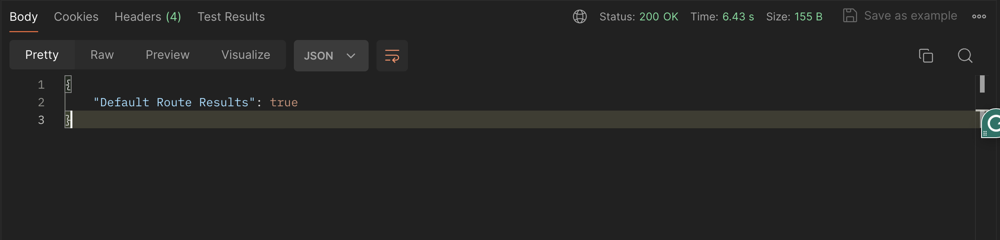

# IntentNetworkAPI
Intent-based Network API - leveraging FastAPI &amp; Cisco PyATS to power intent.

Python Code driven by FastAPI and Cisco's PyATS framework to demonstrate powering Network Automation via Intent based APIs.

## Overview

This code base is a combination of a FastAPI framework and Cisco PyATS to show-case the capability of building Intent based APIs that perform specific functions within the network infrastructure. This would range from health checks, to performing specific actions via endpoints. 

## Use Case Description

This use case is very helpful for exploring the concept of Intent based network APIs based on FastAPI as an underlying framework and using Cisco PyATS to connect to a device, check for the prescence of a default route (0.0.0.0/0) and return a result via the call.   

**Python**

The script is written in python using PYATS to interact with the active devices, and return the results as the response to a FastAPI call.  

**Output**: 

Once the python script is started, we utilize Postman to push the API endpoint to identify the response body.

## Contacts
*Oluyemi Oshunkoya (yemi_o@outlook.com)

## Solution Components
**Python**

**Genie**

**PYATS**

**FastAPI**

## Prerequisites 

Python3.6 and above
API Client (e.g Postman)

## Step 1 - Setting up the enivronment
This can be done either by using the pre-setup docker image for PYATS or using your python environment. 

### Option A - Using the Docker Image 

1. Download and setup docker suitable for your Operating System 
https://docs.docker.com/get-docker/

2. Download the latest version of the PYATS from docker hub
   
'''
$ docker pull ciscotestautomation/pyats:latest
'''

4. Run the docker image 

'''
$ docker run -it ciscotestautomation/pyats:latest /bin/bash
'''

4. Clone the repository

'''
git clone https://github.com/yzmar4real/IntentNetworkAPI.git
'''

5. CD into the directory 
'''
cd IntentNetworkAPI

6. Execute the requirement.txt file to install the requirements for the project

'''
pip3 install -r requirements.txt
'''

### Option B - Using GIT to setup the environment

1. Clone the repository

git clone https://github.com/yzmar4real/IntentNetworkAPI.git

2. CD into the directory 

cd IntentNetworkAPI

3. Use the directory as a virtual environment for the project

python3 -m venv . 

4. Start the virtual environment and install the requirements for the project

source bin/activate

5. Execute the requirement.txt file to install the requirements for the project

pip3 install -r requirements.txt

## Step 2 - Defining the Testbed for devices to be audited

1. Edit genie.yml file to include parameters for your devices. The default file in the example connects to Cisco's Always On IOSXE sandbox. 

## Step 3 - Executing the Script 

1. Execute the main script from console

python3 Main.py

## Step 4 - Use Postman or Other Suitable Client to Trigger the API

1. URL to be executed is :

   http://<your_device_ip_address>:3443/v1/route_check  (in the example below - its http://10.40.10.18/v1/route_check)

2. Execute the API via Postman Client on the suggested port.(3443)

3. Results should show as below

